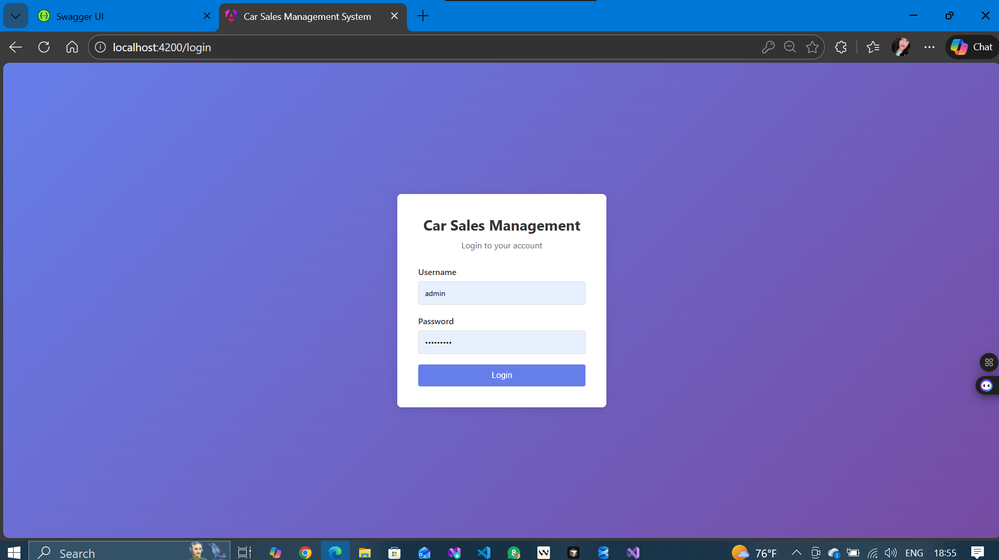
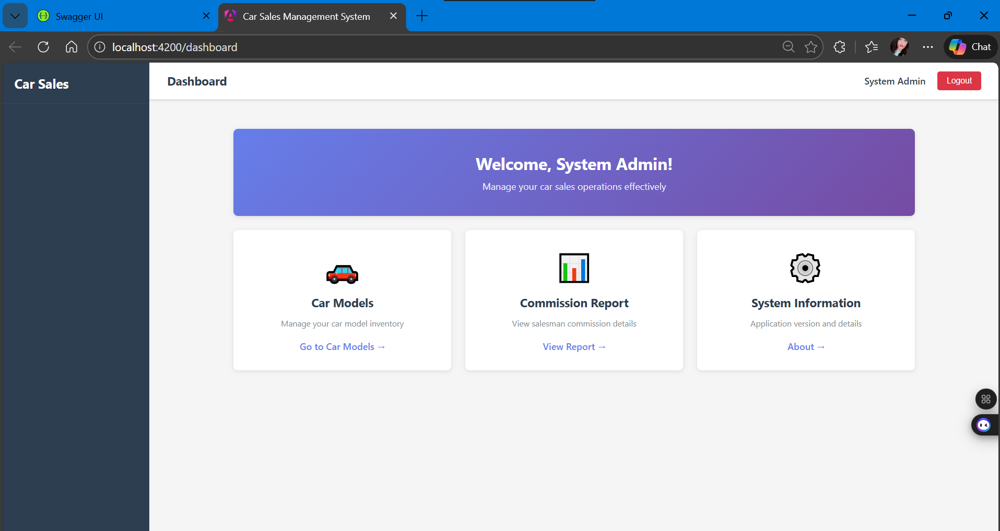
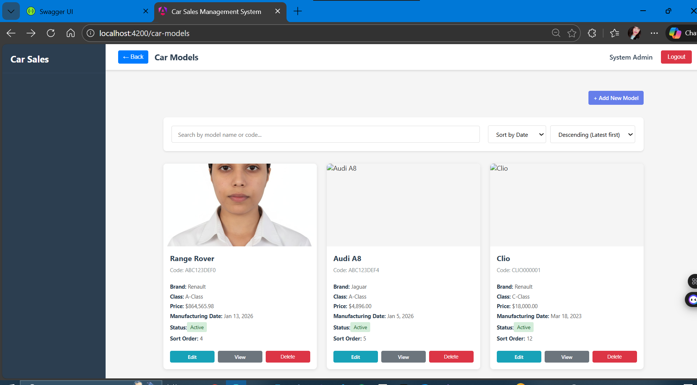
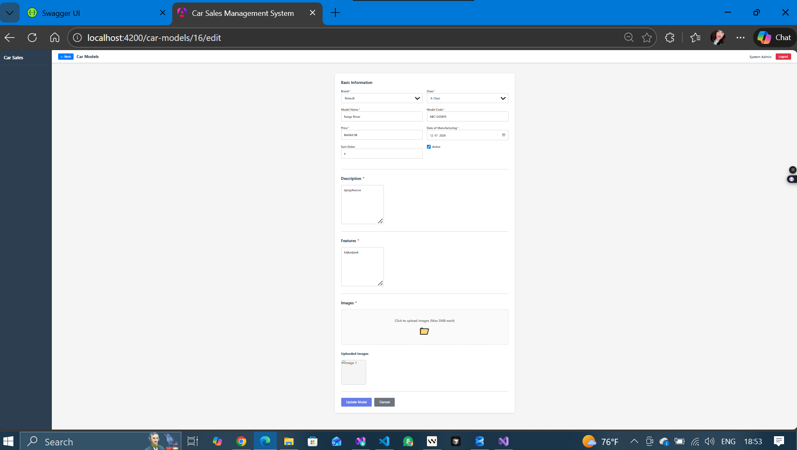
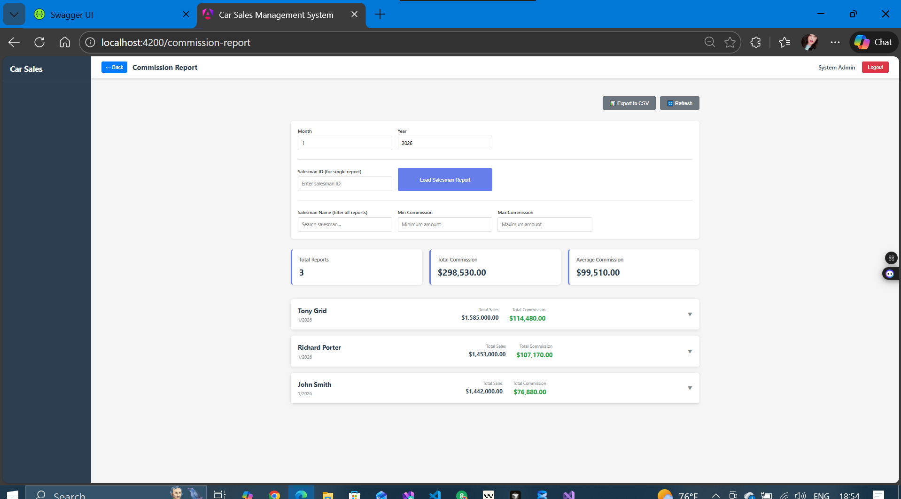
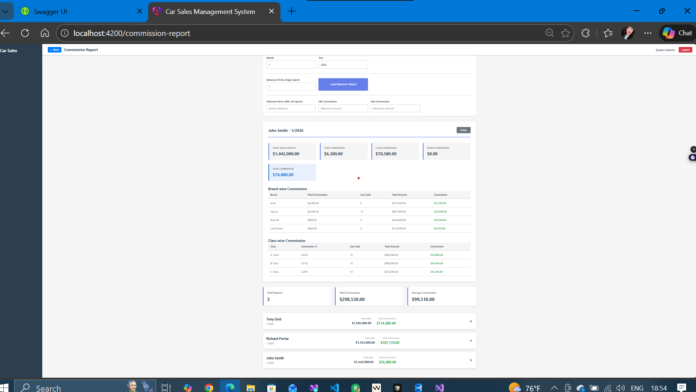
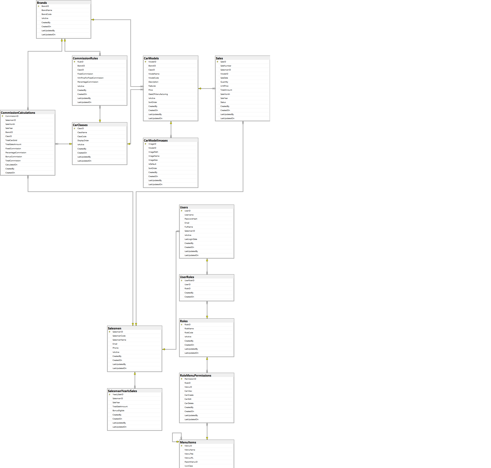

# 🚗 Car Sales Management API

  
  
  
  
  

<table>
<tr>
<td></td>
<td></td>
<td></td>
</tr>
<tr>
<td></td>
<td></td>
<td></td>
</tr>
</table>

Car Sales Management System is a full-stack web application developed using .NET Core for backend, Angular 14 for frontend, and Microsoft SQL Server as the database. The system manages car models, users, roles, and sales commission calculations.

---

## Tech Stack

- Backend: .NET Core 8, C#
- Frontend: ⚠️ Note: The frontend is implemented using Angular 21 (latest stable) instead of Angular 14 to leverage improved performance and long-term support. The architecture and concepts remain fully compatible with Angular 14.
- Database: MSSql (Microsoft SQL Server)
- Data Access: Dapper
- Authentication: JWT
- Tools: Git, GitHub, Swagger, Postman

---

## Features

- Car model management (Add, Update, Delete, View)
- Brand and car class management
- Role-based authentication and authorization
- Sales commission calculation based on business rules
- Secure REST APIs using JWT
- Angular frontend with guards and interceptors

---

## Project Structure

CarSalesManagement/
│
├── API/            → .NET Core Backend
├── UI/             → Angular Frontend
├── Database/
└── README.md

---

## Database

The Database folder contains:
- schema → Table creation scripts
- Stored Procedure → Initial insStored Procedure scripts
- ERD.png → Entity Relationship Diagram

---

## Setup Instructions

### Backend Setup
1. Open the API project in Visual Studio
2. Update SQL Server connection string in `appsettings.json`
3. Execute `schema.sql` and `seed-data.sql` in SQL Server
4. Run the API project
5. Swagger will be available at `/swagger`

### Frontend Setup
1. Go to `UI/car-sales-ui`
2. Install dependencies:
   npm install
3. Run application:
   ng serve or npm start

---

## API Documentation

Swagger UI is enabled for API testing:
`/swagger`

---

## Author

Palak Mishra  
.NET & Angular Developer  
GitHub: https://github.com/mispalak9
